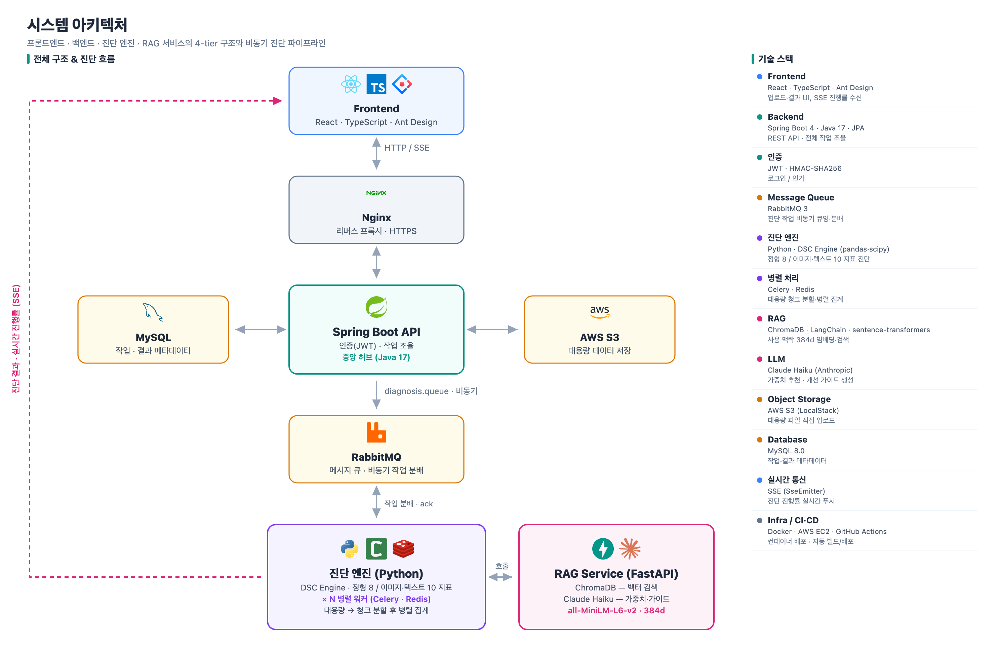
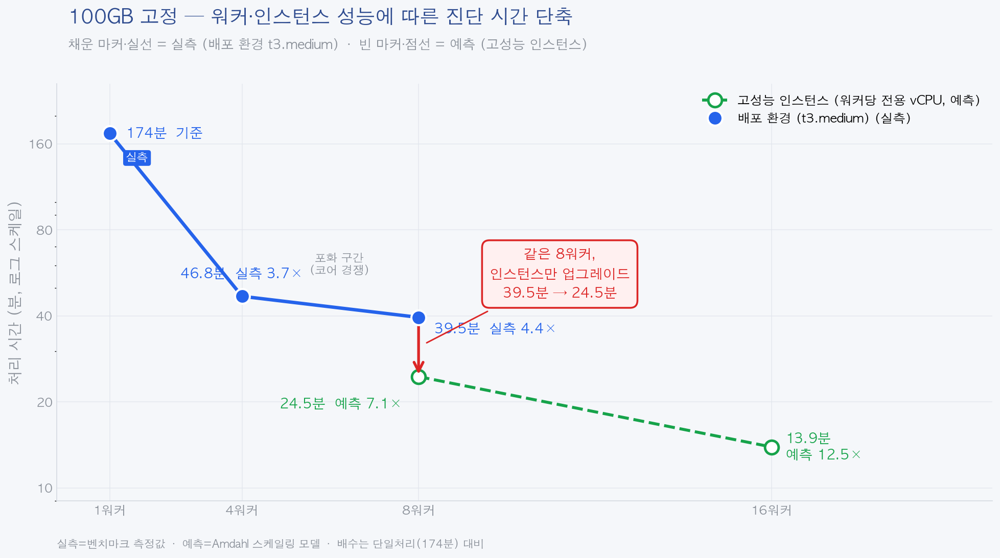
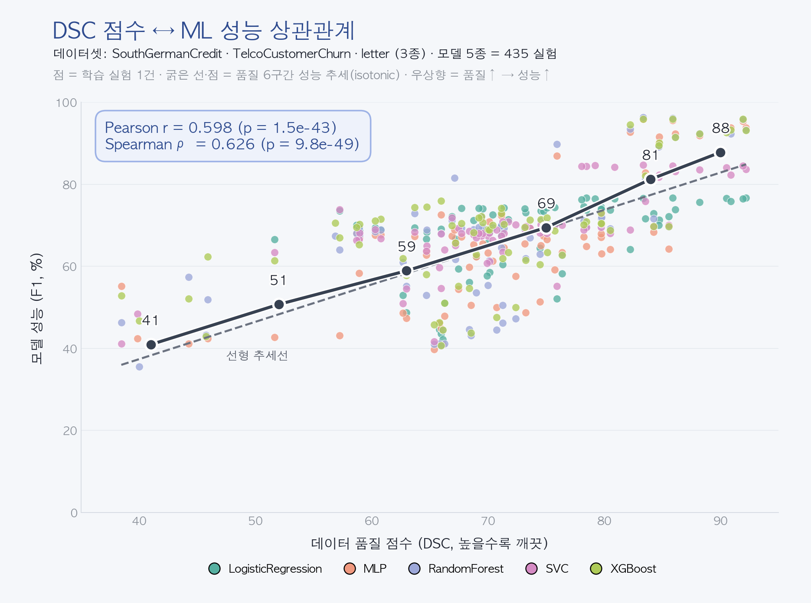

# Scorecard — AI-Ready 데이터 품질 진단 플랫폼

데이터셋을 업로드하면 품질을 자동 진단하고, RAG 기반 LLM이 개선 가이드를 생성하는 플랫폼입니다.
정형 CSV뿐 아니라 비정형(이미지 ZIP·텍스트 CSV)까지 진단하며, 대용량은 **byte-range 병렬 분산 엔진**으로 처리합니다.

> **운영 환경:** https://aidq.duckdns.org (Let's Encrypt HTTPS)

## 핵심 기능

- **Presigned URL 직접 업로드** — 서버를 거치지 않고 S3에 직접 업로드 (대용량 지원)
- **RAG 기반 맞춤 가중치 추천** — 사용 목적·데이터 유형에 따라 ChromaDB 검색 + Claude Haiku가 지표 가중치 추천
- **정형 진단 (DSC v3.2, 8지표)** — completeness, uniqueness, validity 등 8개 품질 지표로 종합 점수(0~100)·등급(A~D) 산출
- **비정형 진단 (DSC v5, 10지표)** — 이미지 ZIP(ResNet18 임베딩) / 텍스트 CSV(DistilBERT 임베딩) 각 10지표, map-reduce Celery chord
- **세분화 진단 (groupBreakdown)** — 그룹별(클래스/컬럼) 점수 분해로 "어느 그룹이 낮은지" 지목. 집계 점수는 불변
- **RAG 기반 개선 리포트** — 진단 결과의 저점 지표를 추출해 기법 문서를 검색, 자연어 개선 가이드를 출처와 함께 생성
- **SSE 실시간 알림** — 폴링 없이 진단 완료 시 즉시 알림 (스코프 격리 단명 티켓 인증)
- **비동기 처리** — RabbitMQ(AMQP) 기반 메시지 큐로 진단 요청/결과 비동기 처리
- **대용량 병렬 분산 진단** — Celery chord로 CSV를 byte-range 청크 분할 → Worker가 S3 Range GET으로 자기 구간만 병렬 진단 → 합산 (Spring Boot 변경 0)

## 아키텍처



*프론트엔드(React) → Nginx(TLS) → Spring Boot API(중앙 허브) → RabbitMQ → DSC 엔진(Python·N개 병렬 워커) → RAG 서비스(FastAPI). MySQL은 메타데이터, AWS S3는 대용량 데이터를 담당합니다.*

> 소용량(<32MB)은 단건 처리, 대용량은 byte-range 청크(기본 256MB, t3 워커 128MB)로 분할 후 Celery chord 병렬 진단.
> **분할 불변성** — 부분 지표를 원시 카운트(가산)로 표현해 청크 경계와 무관하게 합산 결과가 동일합니다(워커수 1/2/4에서 score 99.96 동일).
> 결과 메시지 형식이 동일해 Spring Boot 변경이 필요 없습니다.

## 성능 (벤치마크)

실 AWS 측정. 격리 환경 **c5.2xlarge(8vCPU)** + 교차검증 **t3 fleet 4워커**.



*100GB(102GB, 약 800청크) 진단: 1워커 약 2.9시간 → 4워커 46.8분(3.7×) → 8워커 39.5분(4.4×). 점수 99.96 무손상. 채워진 마커는 실측, 빈 마커는 Amdahl 예측.*

| 워커 수 | 100GB 소요 | Speedup |
|--------:|-----------:|--------:|
| 1 | 약 2.9시간 (외삽 추정) | 1.00× |
| 4 | 46.8분 | 3.69× |
| 8 | 39.5분 | 4.38× |

- **분할 정확도:** 직렬 준비(경계 스냅)는 전체의 약 3%(87초)만 차지하며, 코디네이터는 헤더+산재 샘플 윈도우+경계 탐침만 읽어 파일 전체를 통독하지 않습니다(실측 303MB에서 약 10.2%만 읽음).
- **하드웨어 무관 재현:** t3 fleet 4워커 **3.79×** ≈ c5 4워커 **3.75×**.
- **Amdahl 예측(측정 기반, s≈1.9%):** 8워커 **7.1×**, 16워커 **12.5×** — 단일 박스 수직 패킹 포화를 수평 확장으로 돌파.

### 연구 — 데이터 품질 ↔ ML 성능 상관



*"데이터 품질(DSC) 점수가 높을수록 모델 성능이 좋아진다"를 실험으로 확인한 상관 연구 (정형 분류 3개 데이터셋·5개 모델·435 실험). 굵은 선은 품질 구간별 성능 추세(isotonic).*

## 기술 스택

| 영역 | 기술 |
|------|------|
| Backend | Spring Boot 4.0.x, Java 17, Spring Security(JWT), Spring Data JPA |
| Frontend | React 19, TypeScript, Vite, Ant Design, axios, react-markdown |
| Database | MySQL 8.0 (JPA ddl-auto=update) |
| Message Queue | RabbitMQ (AMQP, direct exchange) |
| Object Storage | AWS S3 (로컬: LocalStack) |
| 진단 엔진 | Python 3.11, DSC v3.2 (정형 8지표) / DSC v5 (비정형 10지표), pandas/numpy |
| 비정형 임베딩 | PyTorch — ResNet18(이미지 512-dim), DistilBERT(텍스트 768-dim) |
| 병렬 처리 | Celery 5 (chord/group), Redis 7 (chord result backend), S3 Range GET |
| RAG | ChromaDB, sentence-transformers (all-MiniLM-L6-v2, 384-dim), FastAPI |
| LLM | Claude Haiku (claude-haiku-4-5, Anthropic API) |
| 실시간 통신 | SSE (스코프 격리 단명 티켓 인증) |
| Auth | JWT (HMAC-SHA256) |
| Infra | Docker Compose, AWS EC2 (서비스 t3.small / 워커 t3.medium, Elastic IP), GitHub Actions CI/CD, Let's Encrypt HTTPS |

## 로컬 개발 환경 세팅

### 사전 요구사항

- **Docker Desktop** (MySQL, RabbitMQ, Redis, LocalStack, RAG, Engine 실행용)
- **Java 17** (Spring Boot 백엔드)
- **Node.js 20** (React 프론트엔드)

### Step 1: 환경변수 설정

프로젝트 루트에 `.env` 파일을 생성합니다. (`.env` 계열은 git에 추적되지 않습니다.)

```properties
# Database
DB_URL=jdbc:mysql://localhost:3306/scorecard?useSSL=false&serverTimezone=Asia/Seoul&allowPublicKeyRetrieval=true
DB_USERNAME=scorecard_user
DB_PASSWORD=scorecard_password

# S3 (LocalStack)
AWS_S3_ENDPOINT=http://localhost:4566
AWS_S3_BUCKET=scorecard-uploads
AWS_ACCESS_KEY_ID=test
AWS_SECRET_ACCESS_KEY=test
AWS_REGION=ap-northeast-2

# RabbitMQ
RABBITMQ_HOST=localhost
RABBITMQ_PORT=5672

# Redis (Celery chord result backend)
REDIS_HOST=localhost
REDIS_PORT=6379

# JWT (팀원에게 공유받기)
JWT_SECRET=<팀원에게 공유받은 값>

# Claude API (RAG 서비스용 — 팀원에게 공유받기)
ANTHROPIC_API_KEY=<팀원에게 공유받은 값>
```

### Step 2: Docker 인프라 실행

```bash
docker compose up -d
```

| 서비스 | 포트 | 용도 |
|--------|------|------|
| MySQL | 3306 | 데이터베이스 |
| RabbitMQ | 5672, 15672 | 메시지 큐 (15672: 관리 UI, guest/guest) |
| LocalStack | 4566 | 로컬 S3 대체 |
| Redis | 6379 | Celery chord result backend (병렬 부분결과 수집) |
| RAG Service | 8001 | RAG 가중치 추천 + LLM 리포트 |
| Engine | - | DSC 진단 워커 (Celery Worker + Bridge) |

### Step 3: RAG 인덱싱 (최초 1회)

```bash
docker exec scorecard-rag python scripts/index_documents.py
```

> ⚠️ ChromaDB 인덱스는 실행 중인 컨테이너 안에만 존재합니다. RAG 컨테이너를 재빌드하면 인덱스가 사라지므로, 다시 인덱싱해야 합니다. ([배포 후 필수](#배포-후-필수--rag-인덱싱) 참고)

### Step 4: 백엔드 + 프론트엔드 실행

```bash
./gradlew bootRun                            # http://localhost:8080
cd frontend && npm install && npm run dev    # http://localhost:5173
```

### 테스트

```bash
./gradlew test
```

## 배포 후 필수 — RAG 인덱싱

> **가장 큰 운영 리스크.** ChromaDB 인덱스는 git에도 없고 이미지에도 구워지지 않아, **실행 중 컨테이너 안에만** 존재합니다. 따라서 RAG 컨테이너를 재빌드하는 매 재배포마다 인덱스가 사라지고(`collection.count() == 0`), 리포트가 출처 없는 일반 LLM 응답으로 폴백됩니다.

매 재배포 후 반드시 다음을 실행해 인덱스를 복구합니다 (CI/CD가 자동 수행하지만, 수동 배포 시 직접 실행):

```bash
docker exec scorecard-rag python scripts/index_documents.py
```

자세한 배포 토폴로지(서비스 박스 / 워커 fleet / HTTPS 갱신)와 운영 절차는 로컬 런북 `docs/operations/DEPLOYMENT.md`를 참고하세요.

## API 엔드포인트

| Method | Path | 설명 | 인증 |
|--------|------|------|------|
| POST | `/api/users/signup` | 회원가입 | - |
| POST | `/api/users/login` | 로그인 (→ JWT) | - |
| POST | `/api/uploads/presign` | S3 Presigned URL 발급 | JWT |
| POST | `/api/jobs/start` | 진단 시작 (presign 흐름) | JWT |
| POST | `/api/jobs/submit` | 멀티파트 직접 업로드 + 진단 | JWT |
| POST | `/api/jobs/{parentJobId}/retry` | 재진단 | JWT |
| POST | `/api/jobs/{parentJobId}/retry-start` | 재진단 시작 | JWT |
| GET | `/api/jobs/list` | 내 작업 목록 | JWT |
| GET | `/api/jobs/{jobId}/status` | 작업 상태 조회 | JWT |
| DELETE | `/api/jobs/{jobId}` | 작업 삭제 | JWT |
| POST | `/api/jobs/subscribe-ticket` | SSE 스코프 티켓 발급 (60초, scope=sse) | JWT |
| GET | `/api/jobs/subscribe?token=<ticket>` | SSE 실시간 스트림 | SSE 티켓 |
| POST | `/api/weights/recommend` | RAG 가중치 추천 | JWT |
| GET | `/api/results/{jobId}` | 진단 결과 조회 | JWT |
| GET | `/api/results/{jobId}/report` | LLM 마크다운 리포트 조회 | JWT |

> **SSE 보안:** EventSource는 헤더를 실을 수 없어 토큰을 쿼리로 전달합니다. 이 위험을 줄이기 위해 60초 `scope=sse` 단명 티켓을 발급하고, 인증 필터에서 일반 액세스 토큰의 SSE 접근과 SSE 티켓의 일반 API 접근을 양방향으로 거부합니다.

## 프로젝트 구조

```
scorecard/
├── src/main/java/.../scorecard/    # Spring Boot 백엔드
│   ├── auth/           # 인증 (회원가입, 로그인)
│   ├── user/           # 사용자 엔티티
│   ├── job/            # 작업 관리 (업로드, Presigned URL, 상태, 삭제)
│   ├── jobresult/      # 진단 결과 조회
│   ├── global/         # 공통 (response, exception, config, util)
│   └── infrastructure/ # s3, mq, sse, llm 연동
├── frontend/                       # React 프론트엔드
│   └── src/
│       ├── api/        # axios API 호출 + SSE 클라이언트
│       ├── pages/      # 페이지 컴포넌트
│       ├── components/ # 공통 컴포넌트
│       └── stores/     # 인증 상태 관리
├── engine/                         # DSC 진단 엔진 (Celery 병렬)
│   ├── dsc_engine.py        # 정형 8지표 + 청크별 부분 지표 계산
│   ├── dsc_cells/           # 비정형 셀 (이미지/텍스트 10지표, seam)
│   ├── unstructured_tasks.py# 비정형 진단 진입 (map-reduce chord)
│   ├── unstructured_loader.py# ZIP(ImageFolder)/CSV 로더 + S3RangeReader
│   ├── partitioner.py       # byte-range 분할 (경계 스냅 + 샘플 탐침)
│   ├── aggregator.py        # 부분 결과 합산 → 최종 점수
│   ├── tasks.py             # Celery 태스크 (coordinator/process_chunk/aggregate)
│   ├── celery_app.py        # Celery 앱 설정 (broker=RabbitMQ, backend=Redis)
│   ├── bridge.py            # pika → Celery 브릿지 (Spring ↔ Celery)
│   ├── benchmark.py         # 벤치마크 스크립트
│   └── worker.py            # (레거시) 단일 RabbitMQ Consumer — 폴백
├── rag-service/                    # RAG 서비스 (FastAPI)
│   ├── rag/                 # retriever(ChromaDB) + generator(Claude Haiku)
│   ├── scripts/
│   │   └── index_documents.py
│   └── documents/           # RAG 참조 코퍼스 (54개 마크다운 문서)
├── docker-compose.yml              # 로컬 개발용 (풀스택)
├── docker-compose.prod.yml         # 운영 서비스 박스 (engine 제외)
├── docker-compose.prod-worker.yml  # 운영 워커 박스 (engine만, t3.medium)
└── docker-compose.bench.yml        # 벤치마크 격리 박스
```

## 진단 엔진 (DSC)

- **정형 DSC v3.2 — 8지표:** completeness(.20), uniqueness(.15), validity(.10), consistency(.10), outlier_ratio(.05), class_balance(.05), feature_correlation(.05), value_accuracy(.30). 점수 0~100, 등급 A≥90 / B≥75 / C≥60 / D<60.
- **비정형 DSC v5 — 10지표:** 이미지(ResNet18 512-dim) / 텍스트(DistilBERT 768-dim)를 임베딩해 각 10지표 산출. 회귀 과제는 class_balance를 제외한 변형을 사용. map-reduce Celery chord로 병렬 처리.
- **세분화(groupBreakdown):** 결과에 그룹별 분해(이미지/텍스트=클래스별, 정형=컬럼별)를 추가. **집계 점수는 불변**(평균 전 값만 보존)이며, 리포트가 저점 그룹을 이름+수치로 지목합니다.
- **병렬 분산(정형 대용량):** 코디네이터가 청크 경계를 newline에 스냅하고, 각 워커가 S3 Range GET으로 자기 구간을 직접 읽어 병렬 진단합니다. 따옴표 내 개행 감지 시 스트리밍 폴백, 워커 예외 시 센티넬 패턴으로 chord 콜백을 항상 실행하는 안전장치를 포함합니다.

## RAG 서비스

- **가중치 추천** (`POST /api/recommend-weights`) — 사용 목적 + 데이터 유형으로 ChromaDB 5건 검색 → Claude Haiku → 정규화된 가중치 JSON + 한국어 근거·출처.
- **리포트 생성** (`POST /api/generate-report`) — 진단 결과의 저점 지표를 추출해 기법 문서를 검색하고 개선 가이드를 생성.
- **코퍼스:** 54개 마크다운 문서 (Kaggle 노트북 예시 34 + 개선 기법 13 + 정의/표준 7, ISO/IEC 25012 등). 한국어 질의를 영어로 번역 후 검색.
- **벡터스토어:** ChromaDB(컬렉션 `rag_docs`), 임베딩 all-MiniLM-L6-v2(384-dim). 인덱싱: `rag-service/scripts/index_documents.py`.

## 팀

| 이름 | 역할 |
|------|------|
| 이지훈 | 웹 플랫폼 개발 (Spring Boot, React, RAG, 병렬 엔진, 인프라) |
| 고준서 | 데이터 품질 진단 엔진 개발 (DSC 정형/비정형 지표) |
| 김동훈 | 프론트엔드 / API 개발 |

## 문서 (로컬)

> `docs/`는 로컬 전용(gitignore)이라 GitHub에서 렌더링되지 않습니다. 아래는 로컬 작업 참고용입니다.

| 문서 | 내용 |
|------|------|
| `docs/OVERVIEW.md` | 전체 프로젝트 단일 조망 (기능·성능·연구·운영 요약) |
| `docs/PRD.md` | 시스템 설계, 인터페이스 계약, API 스펙 |
| `docs/architecture.md` | 기술 스택, 아키텍처, 패키지 구조 |
| `docs/reference/engine.md` | 엔진 레퍼런스 (DSC 지표, 병렬화, MQ 계약) |
| `docs/reference/backend.md` | 백엔드 레퍼런스 (패키지·엔드포인트·SSE 보안) |
| `docs/api-endpoints.md` | API 엔드포인트 목록 |
| `docs/operations/DEPLOYMENT.md` | 배포·운영 런북 (토폴로지, RAG 인덱싱, HTTPS 갱신) |
| `docs/operations/POST-DEPLOY-CHECKLIST.md` | 배포 후 필수 체크리스트 |
| `docs/decisions/` | ADR — 기술 의사결정 기록 (ADR-001~006) |
| `docs/develop.md` | PHASE별 진행 현황 |
| `docs/conventions.md` | 코드 컨벤션, 빌드 명령, 환경변수 |
